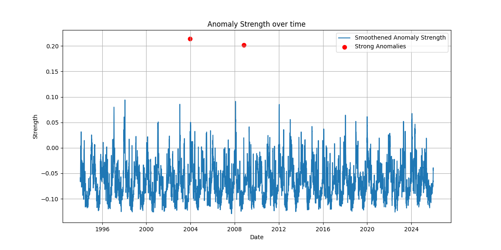
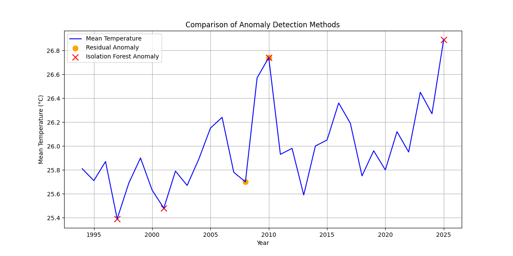

# Extreme Weather Anomaly Detection 🌦️📉

## 📖 Overview
This project focuses on identifying extreme weather anomalies using advanced time-series analysis and unsupervised machine learning. By analyzing historical weather data, the project isolates underlying temperature trends, seasonal variations, and statistically significant deviations that represent extreme weather events.

## 🗄️ Data Source
The weather data used in this project is sourced from the **[Open-Meteo Historical Weather API](https://open-meteo.com/en/docs/historical-weather-api)**. 
- **Location**: Kolkata, West Bengal, India (Latitude: 22.5626, Longitude: 88.363).
- **Features Analyzed**: Mean temperature, max/min temperature, precipitation, cloud cover, and derived metrics like temperature range and day-to-day average changes.

## 🛠️ Setup and Installation

To run this project locally, follow these steps:

1. **Clone the repository** (if you haven't already):
   ```bash
   git clone https://github.com/ABANTIKA06/Weather_Forecast.git
   cd Weather_Proj
   ```

2. **Activate the Virtual Environment**:
   The project uses a Python virtual environment to manage dependencies.
   ```bash
   source venv/bin/activate  # On Linux/macOS
   # or
   .\venv\Scripts\activate   # On Windows
   ```

3. **Install Dependencies**:
   *(Note: Ensure you have generated a `requirements.txt` from your current environment by running `pip freeze > requirements.txt`)*
   ```bash
   pip install -r requirements.txt
   ```
   **Core Libraries Used**: `pandas`, `numpy`, `scikit-learn`, `statsmodels`, `matplotlib`.

4. **Run the Analysis Scripts**:
   Navigate to the `Scripts/` directory to run the analytical models. For example, to run the multivariate anomaly detection:
   ```bash
   python Scripts/severity_anomaly_score.py
   ```

## 🧠 Methodology & Techniques
This project implements several advanced data analysis techniques:
1. **Time-Series Decomposition**: Using `statsmodels.tsa.seasonal_decompose` to break down historical temperature data into `Trend`, `Seasonality`, and `Residuals`. Anomalies are flagged based on residual standard deviation.
2. **Machine Learning Anomaly Detection**: Utilizing `IsolationForest` from `scikit-learn` to detect outliers in a multivariate feature space (temperature, cloud cover, precipitation).
3. **Statistical Smoothing**: Applying rolling averages to smoothen anomaly strength over time for better interpretation.

## 📊 Key Findings

By combining statistical decomposition with machine learning, the models successfully isolate days with severe weather anomalies that deviate significantly from expected seasonal patterns.

### 1. Multivariate Anomaly Strength
This plot demonstrates the severity of weather anomalies over time, calculated using an Isolation Forest on multiple weather features. The red points indicate the most severe weather events.



### 2. Method Comparison (Residuals vs. Isolation Forest)
This visualization compares the anomalies found via purely statistical time-series residuals against the Isolation Forest model, showing how machine learning can capture different complex patterns.




